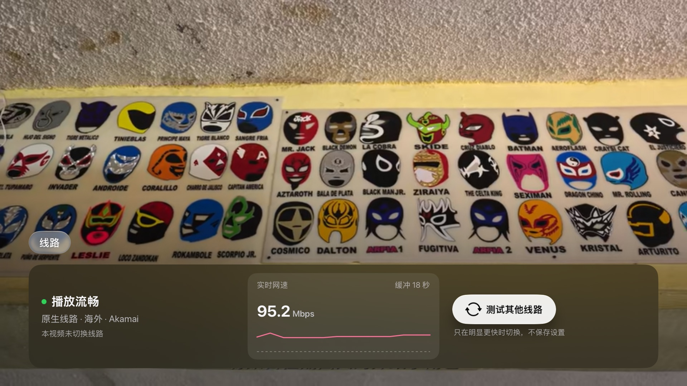

# Bilibili Accelerator TV

面向 Apple TV 的哔哩哔哩非官方客户端，基于 [yichengchen/ATV-Bilibili-demo](https://github.com/yichengchen/ATV-Bilibili-demo)，增加点播线路加速与 tvOS 原生界面。支持 tvOS 16 及以上。

> 本项目为非官方、非商业的开源项目，与哔哩哔哩及 Apple 无任何关联，未在任何平台上架或收费。详见[免责声明](#免责声明)。

## 界面


| 视频详情 | 播放 · 线路面板 |
| :---: | :---: |
|  |  |
| **热门** | **直播** |
|  |  |

截图取自 Apple TV 4K 与 tvOS 模拟器，1080p。

## 与上游的差异

| 模块 | 说明 |
| --- | --- |
| 线路加速 | 点播视频的音视频分片经本机回环代理拉取，按实测吞吐在哔哩哔哩 CDN 节点间择优切换 |
| 线路面板 | 播放器信息面板新增「线路」页：播放状态、当前节点、切换次数、实时网速与缓冲、手动测试其他线路 |
| 界面 | 统一的深色主题与 tvOS 原生控件：推荐页焦点大图、视频卡片、视频详情页、侧栏与分组设置 |

## 线路加速

仅作用于点播视频，直播不经过代理。

1. **转发与测量。** 播放器的音视频分片请求由本机回环地址上的 HTTP 代理转发至 CDN，代理记录各节点的首字节时延与吞吐。
2. **触发条件。** 当前节点传输满 4 MB 或 8 秒后，持续吞吐低于视频码率的 1.2 倍且前向缓冲不足 30 秒；或单个请求失败、停滞。
3. **竞速与切换。** 触发后，下一个分片由两个候选节点同时下载。仅当胜者用时不超过原节点所需时间的 2/3 时，该视频的后续请求才迁移到胜者。
4. **候选范围。** 限于哔哩哔哩为该视频签发的地址及其自有 UPOS 镜像（`*.bilivideo.com`）。节点状态按视频保存，播放结束即丢弃，不写入设置。

开关位于 设置 › 音视频 › 线路加速（实验），默认开启。算法移植自 [realzza/bilibili-accelerator](https://github.com/realzza/bilibili-accelerator) 用户脚本，代码位于 `Packages/BiliAccelerator`。

## 功能

- **账号：** 二维码登录，多账号切换
- **浏览：** 推荐、热门、排行榜、关注、收藏、稍后再看、历史记录、每周必看、搜索
- **播放：** 系统播放器，MPEG-DASH，HDR，无损音频与杜比全景声，字幕，倍速，续播与连播
- **弹幕：** 视频与直播弹幕，屏蔽与去重，智能防挡
- **其他：** 直播，热门评论，云视听小电视投屏，空降助手

## 构建

本仓库不发布安装包，需自行构建并签名。环境要求：

- Xcode 26 或更新版本
- Apple 开发者账号（免费账号签名有效期为 7 天）

用 Xcode 打开 `BilibiliLive.xcodeproj`，在 Signing & Capabilities 中选择开发团队（必要时修改 Bundle Identifier），然后在 Apple TV 上运行。命令行构建：

```bash
fastlane build_simulator
```

```bash
fastlane build_unsign_ipa
```

加速模块的单元测试：

```bash
swift test --package-path Packages/BiliAccelerator
```

## 隐私与网络

- 账号凭据（Cookie 与 access_key）仅保存在本机应用沙盒内，只发送至哔哩哔哩官方接口。
- 线路加速的代理在设备上只接受本机连接，测量数据只保存在本机。调试服务（局域网端口 7779）仅存在于 Debug 构建。
- 以下可选功能会访问第三方服务：
  - **空降助手：** 向 BilibiliSponsorBlock（`bsbsb.top`）查询片段，请求中只包含视频 BV 号 SHA-256 摘要的前 2 位十六进制字符。
  - **港澳台解锁：** 向用户自行配置的解析服务器请求播放地址，请求中包含账号 access_key。本项目不提供解析服务器，请仅使用可信的自建服务器。

## 致谢

- [yichengchen/ATV-Bilibili-demo](https://github.com/yichengchen/ATV-Bilibili-demo) 及其全部[贡献者](https://github.com/yichengchen/ATV-Bilibili-demo/graphs/contributors)：本项目的基础。
- [realzza/bilibili-accelerator](https://github.com/realzza/bilibili-accelerator)：线路加速算法的来源。
- 上游项目引用的资料：
  - App 图标：[【22娘×33娘】亲爱的UP主，你怎么还在咕咕咕？](https://www.bilibili.com/video/BV1AB4y1k7em)
  - [thmatuza/MPEGDASHAVPlayerDemo](https://github.com/thmatuza/MPEGDASHAVPlayerDemo)
  - [dreamCodeMan/B-webmask](https://github.com/dreamCodeMan/B-webmask)
  - [分析 Bilibili 客户端的「哔哩必连」协议](https://xfangfang.github.io/028)
- 空降助手数据：[hanydd/BilibiliSponsorBlock](https://github.com/hanydd/BilibiliSponsorBlock) 社区。
- 开源依赖：[Alamofire](https://github.com/Alamofire/Alamofire)、[SwiftyJSON](https://github.com/SwiftyJSON/SwiftyJSON)、[SwiftProtobuf](https://github.com/apple/swift-protobuf)、[Kingfisher](https://github.com/onevcat/Kingfisher)、[SnapKit](https://github.com/SnapKit/SnapKit)、[CocoaLumberjack](https://github.com/CocoaLumberjack/CocoaLumberjack)、[CocoaAsyncSocket](https://github.com/robbiehanson/CocoaAsyncSocket)、[GzipSwift](https://github.com/1024jp/GzipSwift)、[Swifter](https://github.com/yichengchen/swifter)、[MarqueeLabel](https://github.com/cbpowell/MarqueeLabel)、[PocketSVG](https://github.com/pocketsvg/PocketSVG)、[SwiftyXMLParser](https://github.com/yahoojapan/SwiftyXMLParser)、[swift-log](https://github.com/apple/swift-log)、[LookinServer](https://github.com/QMUI/LookinServer)，以及内置的 [DanmakuKit](https://github.com/qyz777/DanmakuKit)。

## 免责声明

1. **非官方。** 本项目与哔哩哔哩（bilibili）及 Apple Inc. 无任何关联，未获其授权或认可。「哔哩哔哩」「bilibili」「Apple TV」「tvOS」等名称与标识归各自权利人所有，文中使用仅为说明兼容对象。
2. **非商业。** 本项目免费开源，仅供个人学习与技术研究。未在 App Store、TestFlight 或任何平台上架，不提供收费版本、订阅或付费服务，不接受以本项目名义进行的商业合作。任何收费提供本项目或其修改版本的行为均与本项目无关，未获本项目认可，由此产生的风险与损失由相关方自行承担。请勿安装来源不明的安装包。
3. **内容版权。** 本项目不存储、不转发、不分发任何音视频内容。所有内容经哔哩哔哩官方接口获取，版权归原作者及平台所有。本文截图中的封面、标题等内容版权归原作者所有，仅用于展示界面。
4. **线路加速。** 仅在哔哩哔哩自有 CDN 节点之间选择，不修改媒体数据，不绕过登录、付费、大会员或版权地区限制。
5. **账号风险。** 使用第三方客户端可能不符合哔哩哔哩用户协议，存在账号受限等风险，由使用者自行承担。请遵守所在地法律法规。
6. **无担保。** 本软件按「原样」提供，不附带任何明示或暗示的担保（见 GPL-2.0 第 11、12 条）。作者不对因使用本软件造成的任何直接或间接损失负责。
7. **权利通知。** 权利人如认为本项目侵犯其合法权益，请通过 [Issues](https://github.com/realzza/bilibili-accelerator-tv/issues) 联系，我们将及时处理。

## 许可证

- 主程序：[GPL-2.0](LICENSE.md)，继承自上游项目。依据 GPL-2.0，分发本项目或其修改版本须同时提供完整源代码，并保留版权与许可声明。
- `Packages/BiliAccelerator`：[MIT](Packages/BiliAccelerator/LICENSE)。
- 第三方依赖遵循各自的许可证。
